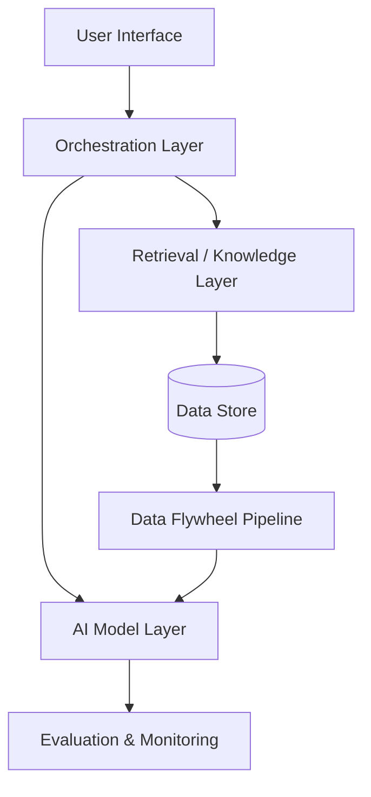
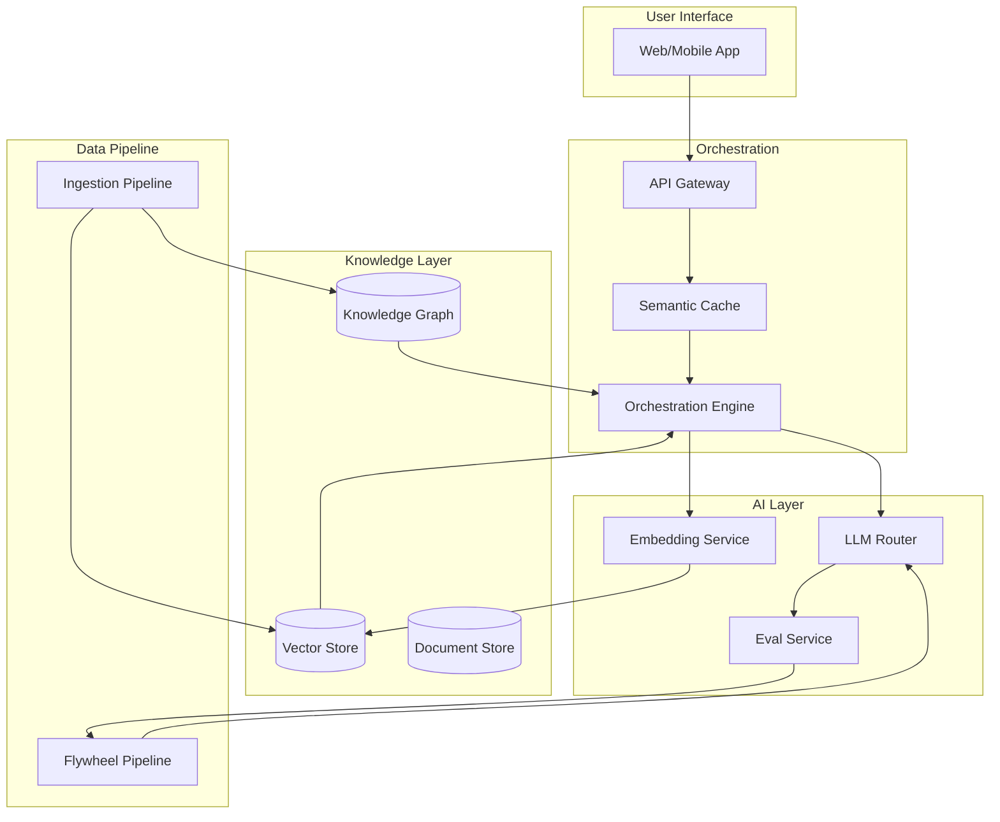
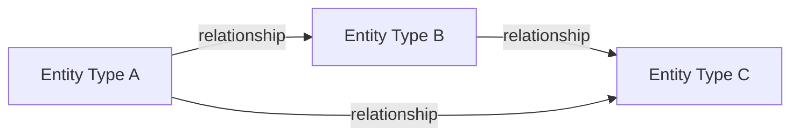

# Output Templates

## Template 1: Strategy Report (for Investors and C-suite Executives)

Target audience: CEO, investors, board members.
Tone: Confident, forward-looking, honest about risks.
Length: 2,500-4,000 words.
Key principle: The report must make the transformative nature of the product
immediately legible. Every section should reinforce why this is a category-creating
opportunity, not a feature launch.

---

### Strategy Report Structure

```markdown
# [Product Name]: AI-Native Strategy Report
*Prepared for: [Audience]*
*Date: [Date]*

---

## Executive Summary

[3-4 paragraphs. This is the most important section — write it last, but place it first.]

Paragraph 1: The transformation thesis. One sentence that captures what paradigm
this product breaks. Two sentences on why now is the inflection point.

Paragraph 2: What the product does and why it would be impossible without AI.
Avoid feature lists — describe the experience and outcome.

Paragraph 3: The competitive moat and why it compounds. One sentence on the business model.

Paragraph 4: What is being asked for / what decision this report supports.

---

## 1. The AI-Native Distinction

### 1.1 What Makes This Transformative, Not Incremental

[Explain the AI-native vs AI-enhanced distinction in the context of this specific product.
Use the Transformation Test result from the diagnosis. Show what the world looks like
before and after this product exists.]

Before: [Describe the current paradigm — how users solve this problem today,
what human effort / time / cost it requires, what quality ceiling it hits]

After: [Describe what becomes possible with the AI-native product — not just "faster"
but "fundamentally different" — new quality levels, new scale, new types of decisions]

The Gap: [Quantify if possible — 10x faster, 100x cheaper, tasks that took expert
weeks now happen in minutes, things impossible at any price now becoming accessible]

### 1.2 Why Now

[The technology inflection point argument. Be specific:]
- What AI capability threshold was crossed in the last 12-24 months that makes this viable?
- What has changed in the market / user expectations that creates adoption readiness?
- What would have prevented this product from working 3 years ago?

### 1.3 Why Incumbents Cannot Simply Add This Feature

[The adaptation trap argument. Why is the transformation structurally difficult
for existing players to execute, even if they wanted to?]

---

## 2. Product Vision

### 2.1 Product Overview

[2-3 paragraphs describing the product from the user's perspective.
Describe the interaction, not the technology. What does a user do?
What do they experience? What outcome do they walk away with?]

### 2.2 User Journey (Current vs. Future State)

Current state:
[Step-by-step of how users solve this problem today — emphasize friction,
time, cost, and quality limits]

Future state with [Product Name]:
[Step-by-step of the AI-native experience — emphasize speed, quality, and what
becomes newly possible]

### 2.3 Product Archetypes

[State which archetype(s) this product embodies: Copilot / Autopilot / Oracle /
Generator / Agent, and what this means for the user experience in plain terms]

---

## 3. Technical Architecture Overview

[For executives: keep this high-level. One Mermaid architecture diagram showing
the major system components and data flows. No implementation details.]

### 3.1 System Architecture

[Include Mermaid diagram here]



### 3.2 Key Technical Decisions

[3-5 bullet points on the major technical choices, explained in business terms:]
- Model strategy: [what model approach and why it fits the cost/quality/compliance needs]
- Knowledge approach: [RAG / fine-tuning / ontology — one sentence on why this choice]
- Infrastructure: [API-first or self-hosted, and why]
- Data architecture: [how private data is protected and leveraged]

### 3.3 Technology Risk Management

[Address the "what if the LLM provider changes its pricing or terms" question.
Show that the architecture has an abstraction layer that mitigates single-vendor risk.]

---

## 4. Data Strategy and Competitive Moat

### 4.1 Data Assets

[Describe the proprietary data assets without revealing sensitive details.
What types of data, why they're strategically valuable, how they were or will be acquired.]

### 4.2 The Competitive Moat

[Explain specifically which of the three moat types applies:]
- Data flywheel: [how user interactions improve the model; the compounding mechanism]
- Domain data exclusivity: [what data is unique and why competitors can't replicate it]
- Workflow lock-in: [how the product becomes embedded in users' daily work]

### 4.3 The Flywheel

[One paragraph + a simple diagram showing the virtuous cycle:
More users → more data → better AI → better product → more users]

```
More Users
    ↓
More Interaction Data
    ↓
Better AI Model
    ↓
Better Product
    ↓
More Users ←
```

---

## 5. Business Model

### 5.1 Monetization Approach

[State the business model and explain why it aligns with how the product creates value.
Avoid jargon — explain it in terms a non-technical executive would understand.]

### 5.2 Unit Economics

[Even at an early stage, show the direction of travel:]
- Inference cost per user/query: [current estimate and optimization path]
- Target gross margin at scale: [percentage]
- Revenue model: [per-seat / usage-based / outcome-based]
- Key metric that predicts LTV: [what user behavior indicates retention]

---

## 6. Competitive Landscape

### 6.1 Landscape Overview

[A brief table or narrative comparing the key players and how this product differs.
Don't claim all competitors are weak — show the honest picture and explain the wedge.]

### 6.2 Sustainable Differentiation

[Explain what cannot be easily copied even if a competitor has more resources.
This should link back to the moat from Section 4.]

---

## 7. Roadmap

### Phase 1 — Foundation [Months 1-N]
Goal: [What must be true at the end of this phase]
Key milestones:
- [Milestone 1]
- [Milestone 2]
Success metric: [One measurable number]

### Phase 2 — Growth [Months N-M]
Goal: [What must be true at the end of this phase]
Key milestones:
- [Milestone 1]
- [Milestone 2]
Success metric: [One measurable number]

### Phase 3 — Scale [Months M+]
Goal: [Category leadership / Series X / Profitability / etc.]
Key milestones:
- [Milestone 1]
- [Milestone 2]
Success metric: [One measurable number]

---

## 8. Risk Assessment

| Risk | Probability | Impact | Mitigation |
|------|-------------|--------|-----------|
| [Risk 1] | High/Med/Low | High/Med/Low | [Mitigation] |
| [Risk 2] | High/Med/Low | High/Med/Low | [Mitigation] |
| [Risk 3] | High/Med/Low | High/Med/Low | [Mitigation] |
| [Risk 4] | High/Med/Low | High/Med/Low | [Mitigation] |

---

## 9. Resource Requirements

[What is needed to execute this strategy:]
- Team: [Key roles and whether to hire or partner]
- Capital: [Investment range and what it funds]
- Infrastructure: [Key technology investments]
- Partnerships: [Data, distribution, or technology partnerships critical to success]

---

## Appendix: Technical Architecture Details

[Optional deeper technical section for readers who want it, without cluttering
the main report. Include more detailed Mermaid diagrams here.]
```

---

## Template 2: Architecture Document

Target audience: Engineering leads, technical due diligence reviewers.
Length: 1,500-2,500 words plus diagrams.
Tone: Precise, grounded in tradeoffs, honest about what is decided vs. TBD.

---

### Architecture Document Structure

```markdown
# [Product Name]: Technical Architecture Document
*Version: 1.0 | Date: [Date] | Status: Draft / Final*

---

## 1. Context and Goals

**Product Brief:** [2-3 sentence summary]
**Primary Constraint:** [The single most important constraint driving architecture decisions]
**Architecture Principles:** [3-5 guiding principles for this system]

---

## 2. System Architecture

### 2.1 Component Overview

[Mermaid diagram: all major components with data flow]



### 2.2 Component Descriptions

[For each component: purpose, technology choice, rationale, known limitations]

---

## 3. Model Strategy

| Model Role | Model Choice | Rationale | Fallback |
|-----------|-------------|-----------|---------|
| [Primary reasoning] | [Model] | [Why] | [Fallback] |
| [Embedding] | [Model] | [Why] | [Fallback] |
| [Reranking] | [Model] | [Why] | [Fallback] |

---

## 4. Knowledge Architecture

[Only include if RAG/ontology is part of the design]

### 4.1 Ontology Schema (if applicable)

[Entity types + relationship types in a diagram or table]



### 4.2 Retrieval Pipeline

[Step-by-step: query → preprocessing → retrieval → reranking → generation]

### 4.3 Indexing Pipeline

[How documents enter the system: ingestion → chunking → embedding → indexing]

---

## 5. Data Flow

### 5.1 Request Flow (Read Path)

[Numbered sequence: user query → system response]

### 5.2 Ingestion Flow (Write Path)

[Numbered sequence: new data → indexed and queryable]

### 5.3 Flywheel Flow (Learning Path)

[Numbered sequence: user feedback → model improvement]

---

## 6. Infrastructure

| Component | Technology | Deployment | Rationale |
|-----------|-----------|------------|---------|
| Vector Store | [e.g., Qdrant / Weaviate / Pinecone] | [Cloud/Self-hosted] | [Why] |
| Knowledge Graph | [e.g., Neo4j / none] | [Cloud/Self-hosted] | [Why] |
| LLM Serving | [e.g., OpenAI API / vLLM] | [API/Self-hosted] | [Why] |
| Observability | [e.g., LangSmith / custom] | [SaaS/Self-hosted] | [Why] |

---

## 7. Evals and Observability

### 7.1 Eval Framework

[What is measured, how, and how often]

### 7.2 Monitoring

[Key metrics, alerting thresholds, on-call runbook reference]

---

## 8. Open Questions and TBDs

[Be explicit about what has not been decided yet and what information is needed
to make those decisions. This is a sign of rigor, not weakness.]

| Question | Decision Needed By | Owner |
|----------|-------------------|-------|
| [Question 1] | [Date] | [Person/Role] |
| [Question 2] | [Date] | [Person/Role] |
```

---

## Template 3: PPT Deck Outline (14 slides, for pptx-author)

Audience: Investors, board members, C-suite executives.
Design principle: One idea per slide. Diagrams over bullet points.
Each slide has a "headline" (the key takeaway, not just a topic label).

When invoking pptx-author, pass this outline along with the full strategy report
content so pptx-author can populate each slide with the actual content.

---

```
SLIDE 1 — TITLE
Headline: [Product name] — [One-sentence transformation thesis]
Content: Company name, date, presenter

SLIDE 2 — THE PROBLEM
Headline: "[Current paradigm] is fundamentally broken for [user type]"
Content: Before-state description; quantify the pain (time/cost/quality ceiling)
Visual: Before/after contrast or timeline showing the problem's scale

SLIDE 3 — THE INSIGHT
Headline: "AI makes [previously impossible thing] possible for the first time"
Content: The insight that unlocks the solution; why this wasn't possible before;
         what changed in the last 12-24 months (the inflection point)

SLIDE 4 — THE PRODUCT
Headline: "[Product name] [what it does] — without AI, this product could not exist"
Content: 3-sentence product description; emphasize the transformation, not features
Visual: Product screenshot or conceptual UI mockup

SLIDE 5 — AI-NATIVE vs AI-ENHANCED
Headline: "This is not a feature — it's a new category"
Content: The distinction explained; why this matters for defensibility
Visual: Side-by-side comparison table or spectrum diagram

SLIDE 6 — HOW IT WORKS (FOR USERS)
Headline: "From [hours of expert work] to [minutes of AI-assisted review]"
Content: User journey — before (current pain) vs after (AI-native experience)
         Keep it concrete: a real user scenario in 3-5 steps
Visual: Before/after journey flow

SLIDE 7 — TECHNICAL ARCHITECTURE
Headline: "Built on a defensible architecture that compounds over time"
Content: High-level architecture diagram (from Architecture Document)
         One sentence per major component; emphasize the flywheel
Visual: Architecture diagram from Mermaid (simplified for executives)

SLIDE 8 — DATA STRATEGY & MOAT
Headline: "Our data advantage grows with every user interaction"
Content: Explanation of the flywheel; what data is proprietary; why it compounds
Visual: Flywheel diagram (circular arrows showing the virtuous cycle)

SLIDE 9 — COMPETITIVE LANDSCAPE
Headline: "Incumbents are structurally unable to make this transition"
Content: Competitor map; the adaptation trap explanation
Visual: 2x2 or positioning map (X: AI-native capability, Y: domain depth)

SLIDE 10 — BUSINESS MODEL
Headline: "[Monetization model] aligned with the value we deliver"
Content: How the product is priced; why this model fits the value creation;
         unit economics direction (CAC, LTV, gross margin target)

SLIDE 11 — TRACTION (if applicable)
Headline: "Early signals validate the transformation thesis"
Content: Key metrics, pilot results, customer testimonials
         If pre-launch: letters of intent, waitlist size, pilot commitments

SLIDE 12 — ROADMAP
Headline: "Three phases from foundation to category leadership"
Content: Phase 1/2/3 goals and key milestones; timeline
Visual: Roadmap timeline with phase transitions

SLIDE 13 — RISK & MITIGATION
Headline: "We have designed for the risks that matter most"
Content: Top 3-4 risks with mitigations shown
Visual: Risk matrix table (clean, 4 rows max)

SLIDE 14 — THE ASK
Headline: "[Specific ask]: to [specific outcome] by [specific date]"
Content: Investment amount / partnership request / decision needed;
         how funds/resources will be used; what success looks like in 18 months
```

---

## File Naming Convention

All files generated by this skill follow a strict naming convention.
Use `{project_id}` and `{analysis_date}` (YYYY-MM) established in Step 0.

### Local filenames (saved during session)

| Output | Local filename |
|---|---|
| 战略报告 | `strategy-report-{analysis_date}.md` |
| 架构文档 | `architecture-doc-{analysis_date}.md` |
| 产品摘要 | `product-brief-{analysis_date}.md` |
| 利益相关者访谈 | `stakeholder-{role}-{alias}.md` |
| 利益相关者综合 | `stakeholder-synthesis-{analysis_date}.md` |
| Delta 文档 | `delta-from-{prev_date}.md` |
| 执行级 Schema | `exec-schema-{analysis_date}.md` |
| 执行级 Prompt 模板 | `exec-prompt-{analysis_date}.md` |
| 执行级 ERP 清单 | `exec-erp-{analysis_date}.md` |
| 执行级用户故事 | `exec-user-stories-{analysis_date}.md` |
| 执行级主流程 | `exec-flow-{analysis_date}.md` |
| 执行级通知规格 | `exec-notification-{analysis_date}.md` |

### GitHub paths (destination in repo)

All files go under: `analysis/{project_id}/{analysis_date}/`

| Output | GitHub path |
|---|---|
| 战略报告 | `analysis/{project_id}/{analysis_date}/strategy-report.md` |
| 架构文档 | `analysis/{project_id}/{analysis_date}/architecture-doc.md` |
| 产品摘要 | `analysis/{project_id}/{analysis_date}/product-brief.md` |
| 利益相关者访谈 | `analysis/{project_id}/{analysis_date}/stakeholder-{role}-{alias}.md` |
| 利益相关者综合 | `analysis/{project_id}/{analysis_date}/stakeholder-synthesis.md` |
| Delta 文档 | `analysis/{project_id}/{analysis_date}/delta-from-{prev_date}.md` |
| 执行级文档（所有） | `analysis/{project_id}/{analysis_date}/exec-{type}.md` |

---

## Auto-Generated Push Commands

After generating any file in Phase 3 or as an execution-level supplement,
always append a ready-to-run push command block at the bottom of the session summary.

Format — generate this block, substituting real values:

```
## 推送到 GitHub

在本机运行以下命令（GITHUB_TOKEN 已设置则无需 --token）：

python push_to_github.py file "strategy-report-{analysis_date}.md" "analysis/{project_id}/{analysis_date}/strategy-report.md"
python push_to_github.py file "architecture-doc-{analysis_date}.md" "analysis/{project_id}/{analysis_date}/architecture-doc.md"
python push_to_github.py file "product-brief-{analysis_date}.md" "analysis/{project_id}/{analysis_date}/product-brief.md"
# ... (one line per generated file)
```

Only include lines for files actually generated in this session.
If no files were generated (stakeholder interview only), omit the block.
